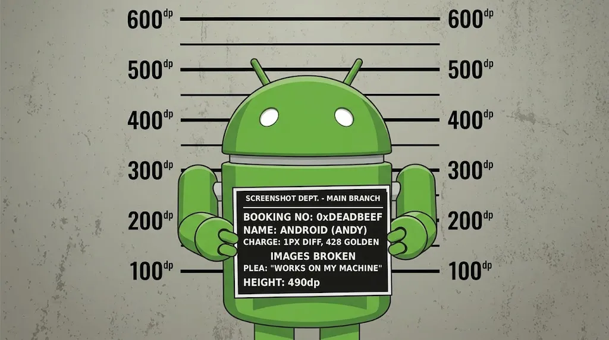

Mugshot
========


An Android library to render your application screens without a physical device or emulator.

### 1. Add the plugin

To a module that already renders Compose previews:

```groovy
plugins {
  id 'com.google.devtools.ksp'
  id 'uk.co.fractalmotion.mugshot'
}
```

### 2. Annotate a preview

```kotlin
@Mugshot
@Preview
@Composable
internal fun ProfileScreenPreview()
```

### 3. Record

```bash
./gradlew recordMugshotDebug
```

That's it. The image is in `src/test/snapshots/images/`, and `./gradlew verifyMugshotDebug`
now fails if that screen ever changes.

No test class, no rule, no `snapshot()` call: the plugin generated the test that renders
every annotated preview in the module. Want more than one image? Add an axis — `@MugshotLightDark`
gives you light and dark, `@MugshotDevices` gives you one per device shape, and they
multiply.

Annotations
-------

`@Mugshot` marks a preview for snapshotting and records one image at the library defaults.
Every other annotation adds an axis:

| Annotation | Renders |
| --- | --- |
| `@Mugshot` | one image at the defaults — required on every snapshotted preview |
| `@MugshotShrink` | wrapped to the content, for components and dialogs |
| `@MugshotFullScreen` | the whole scrollable height in one image |
| `@MugshotDevices` | `PHONE`, `FOLDABLE`, `TABLET`, `LANDSCAPE` — or the ones you name |
| `@MugshotWear` | a round and a square watch |
| `@MugshotLightDark` | light and dark |
| `@MugshotFontScales` | `1f`, `1.5f`, `2f` — or the ones you name |
| `@MugshotLocales("ar")` | the default locale plus each you name, mirroring RTL ones |
| `@MugshotMatrix` | devices × light/dark × font scales — 24 images |

`MugshotDevice` is one of `PHONE`, `FOLDABLE`, `TABLET`, `LANDSCAPE`, `WEAR_ROUND`,
`WEAR_SQUARE`.

### Axes multiply

Each annotation is an independent axis, and the images are their cross-product. Narrow a
matrix by passing arguments rather than by dropping an annotation:

```kotlin
@Mugshot
@MugshotDevices(MugshotDevice.PHONE, MugshotDevice.TABLET)
@MugshotLightDark
@Preview
@Composable
internal fun ProfileScreenPreview() { ... }
// 2 devices × 2 appearances = 4 images
```

`@MugshotLocales` is the one axis that keeps a baseline of its own: the others already
include theirs (`PHONE`, light, `1f`), so naming a single locale gives you two images — the
default and that locale.

### Bundling

The annotations target annotation classes as well as functions, so a team can put its house
style behind one name:

```kotlin
@Mugshot
@MugshotDevices(MugshotDevice.PHONE, MugshotDevice.TABLET)
@MugshotLightDark
annotation class OurScreenshots

@OurScreenshots
@Preview
@Composable
internal fun ProfileScreenPreview() { ... }
```

### Preview parameters

A `@PreviewParameter` provider is expanded when the test runs, one image per value, so a
single preview covers a screen's loading, empty and populated states:

```kotlin
@Mugshot
@Preview
@Composable
internal fun StorefrontScreenPreview(
  @PreviewParameter(StorefrontStateProvider::class) state: StorefrontUiState
) {
  MyTheme { StorefrontScreen(state) }
}
```

Images are indexed (`_0`, `_1`, …) rather than named after the value, because a value's
`toString()` is not safe in a filename.

### Rules

An annotated function must be `@Composable`, must carry a `@Preview`, must not be `private`,
and must take no parameters other than a single `@PreviewParameter`.

Two things that surprise people:

- **`@Preview`'s own arguments are ignored.** Mugshot takes its configuration from the
  annotations above, so setting `device`, `uiMode`, `locale` or `fontScale` on `@Preview`
  changes what the IDE renders without changing the golden.
- **A `@MugshotFullScreen` preview must not scroll itself.** That mode measures with an
  unbounded height so it can draw the whole screen at once, which `Modifier.verticalScroll`
  and `Scaffold` both reject. Either the app scrolls the content or the renderer expands to
  fit it.

### Where the images go

The generated test is `MugshotGeneratedPreviewTest`, in your module's namespace, so goldens
are named:

```
<namespace>_MugshotGeneratedPreviewTest_snapshot[<preview>_<axes>].webp
```

for example
`com.example.myapp_MugshotGeneratedPreviewTest_snapshot[ui_ProfileScreen_ProfileScreenPreview_Dark].webp`.

Tasks
-------

Each task has an anchor form that covers every variant and a per-variant form
(`recordMugshotDebug`, `verifyMugshotRelease`, and so on).

| Task | Does |
| --- | --- |
| `recordMugshot` | writes golden images to `src/test/snapshots` |
| `verifyMugshot` | renders and compares against the goldens |
| `cleanRecordMugshot` | deletes the goldens, then records |
| `deleteMugshotSnapshots` | deletes the goldens |

```bash
./gradlew recordMugshotDebug
./gradlew verifyMugshotDebug
./gradlew verifyMugshotDebug --tests '*ProfileScreen*'
```

Verification failures write a diff for each mismatch to `build/mugshot/failures`. Running
the tests directly — `./gradlew testDebugUnitTest` — produces an HTML report of every
snapshot at `build/reports/mugshot/<variant>`.

To gate CI on your goldens:

```groovy
tasks.named("check").configure {
  dependsOn("verifyMugshot")
}
```

Configuration
-------

Set these in `gradle.properties`; the plugin forwards them to the test JVM.

| Property | Default | Does |
| --- | --- | --- |
| `uk.co.fractalmotion.mugshot.differ` | `offbytwo` | image comparison: `offbytwo`, `pixelperfect`, `mssim`, `sift`, `flip`, `de2000` |
| `uk.co.fractalmotion.mugshot.maxPercentDifferenceDefault` | `0.01` | how much difference a verification tolerates |
| `uk.co.fractalmotion.mugshot.defaultLocale` | unset | locale for every snapshot, e.g. `fr-rFR` |
| `uk.co.fractalmotion.mugshot.overwriteOnMaxPercentDifference` | `false` | rewrite goldens that differ within the threshold |

Beyond annotations
-------

Some things the annotations do not reach. For those, drive the rule yourself:

```kotlin
class ProfileScreenTest {
  @get:Rule
  val mugshot = Mugshot(
    deviceConfig = DeviceConfig.PIXEL_6,
    theme = "android:Theme.Material.Light.NoActionBar",
    showSystemUi = true
  )

  @Test
  fun profile() {
    mugshot.snapshot { MyTheme { ProfileScreen(state = sampleProfile) } }
  }
}
```

Reachable only this way: `unsafeUpdateConfig` to change device, theme or rendering mode
part-way through a test; a custom `RenderExtension` to decorate every snapshot;
`showSystemUi`, `useDeviceResolution` and `maxPercentDifference`; and Android Views, via
`mugshot.inflate<MyView>(R.layout.my_view)` and `mugshot.snapshot(view)`. For JUnit 5, build
the rule yourself and call `setup(TestName(...))` and `teardown()` around each test.

The [sample][sample] project's `screen/` and `component/` test packages have worked examples
of each.

Git LFS
--------
It is recommended you use [Git LFS][lfs] to store your snapshots.  Here's a quick setup:

```bash
brew install git-lfs
git config core.hooksPath  # optional, confirm where your git hooks will be installed
git lfs install --local
git lfs track "**/snapshots/**/*.webp"
git add .gitattributes
# Optional to improve git checkout performance
git config lfs.setlockablereadonly false
```

On CI, you might set up something like:

`$HOOKS_DIR/pre-receive`
```bash
# compares files that match .gitattributes filter to those actually tracked by git-lfs
diff <(git ls-files ':(attr:filter=lfs)' | sort) <(git lfs ls-files -n | sort) >/dev/null

ret=$?
if [[ $ret -ne 0 ]]; then
  echo >&2 "This remote has detected files committed without using Git LFS. Run 'brew install git-lfs && git lfs install' to install it and re-commit your files.";
  exit 1;
fi
```

`your_build_script.sh`
```bash
if [[ is running snapshot tests ]]; then
  # fail fast if files not checked in using git lfs
  "$HOOKS_DIR"/pre-receive
  git lfs install --local
  git lfs pull
fi
```

Jetifier
--------

If using Jetifier to migrate off Support libraries, add the following to your `gradle.properties` to
exclude bundled Android dependencies.

```properties
android.jetifier.ignorelist=android-base-common,common
```

Lottie
--------

When taking screenshots of Lottie animations, you need to force Lottie to not run on a background thread, otherwise Mugshot can throw exceptions [#494](https://github.com/cashapp/paparazzi/issues/494), [#630](https://github.com/cashapp/paparazzi/issues/630).

```kotlin
@Before
fun setup() {
    LottieTask.EXECUTOR = Executor(Runnable::run)
}
```

LocalInspectionMode
--------
Some Composables -- such as `GoogleMap()` -- check for `LocalInspectionMode` to short-circuit to a `@Preview`-safe Composable.

However, Mugshot does not set `LocalInspectionMode` globally to ensure that the snapshot represents the true production output, similar to how it overrides `View.isInEditMode` for legacy views.

As a workaround, we recommend wrapping such a Composable in a custom Composable with a `CompositionLocalProvider` and setting `LocalInspectionMode` there.

```kotlin
@Mugshot
@Preview
@Composable
internal fun MapPreview() {
  CompositionLocalProvider(LocalInspectionMode provides true) {
    YourComposable()
  }
}
```

Releases
--------

Our [change log][changelog] has release history.

Using plugin application:
```groovy
buildscript {
  repositories {
    mavenCentral()
    google()
  }
  dependencies {
    classpath 'uk.co.fractalmotion.mugshot:mugshot-gradle-plugin:3.0.2'
  }
}

apply plugin: 'uk.co.fractalmotion.mugshot'
```

Using the plugins DSL:
```groovy
plugins {
  id 'uk.co.fractalmotion.mugshot' version '3.0.2'
}
```

Snapshots of the development version are available in [the Central Portal Snapshots repository][snap].

```groovy
repositories {
  // ...
  maven {
    url 'https://central.sonatype.com/repository/maven-snapshots/'
  }
}
```

Credits
-------

Mugshot is a fork of [Paparazzi][upstream], created and maintained by Square, Inc.
Essentially all of the hard engineering here — the layoutlib integration, the
resource loading, the rendering pipeline — is their work. This fork exists to take
the project in a direction that would have been too breaking to land upstream, and
is not affiliated with, endorsed by, or sponsored by Square, Inc. or Cash App.

See [NOTICE](NOTICE) for the full attribution and a summary of what has changed.

License
-------

```
Copyright 2019 Square, Inc.
Copyright 2026 Fractal Motion

Licensed under the Apache License, Version 2.0 (the "License");
you may not use this file except in compliance with the License.
You may obtain a copy of the License at

   http://www.apache.org/licenses/LICENSE-2.0

Unless required by applicable law or agreed to in writing, software
distributed under the License is distributed on an "AS IS" BASIS,
WITHOUT WARRANTIES OR CONDITIONS OF ANY KIND, either express or implied.
See the License for the specific language governing permissions and
limitations under the License.
```

 [mugshot]: https://trazdev.github.io/Mugshot/
 [sample]: https://github.com/TRazDev/Mugshot/tree/main/sample
 [lfs]: https://git-lfs.github.com/
 [upstream]: https://github.com/cashapp/paparazzi
 [changelog]: https://trazdev.github.io/Mugshot/changelog/
 [snap]: https://central.sonatype.com/service/rest/repository/browse/maven-snapshots/uk/co/fractalmotion/mugshot/
