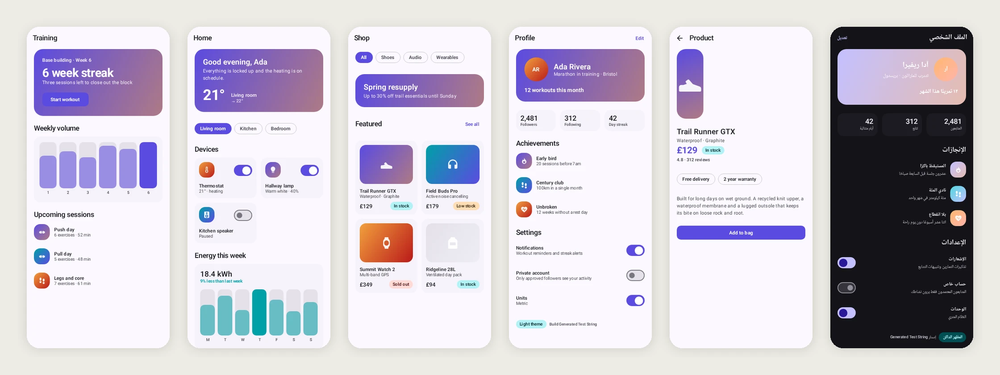
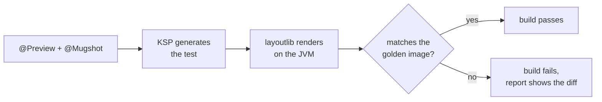
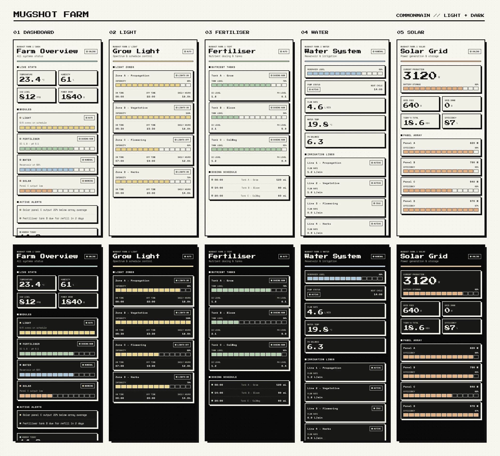
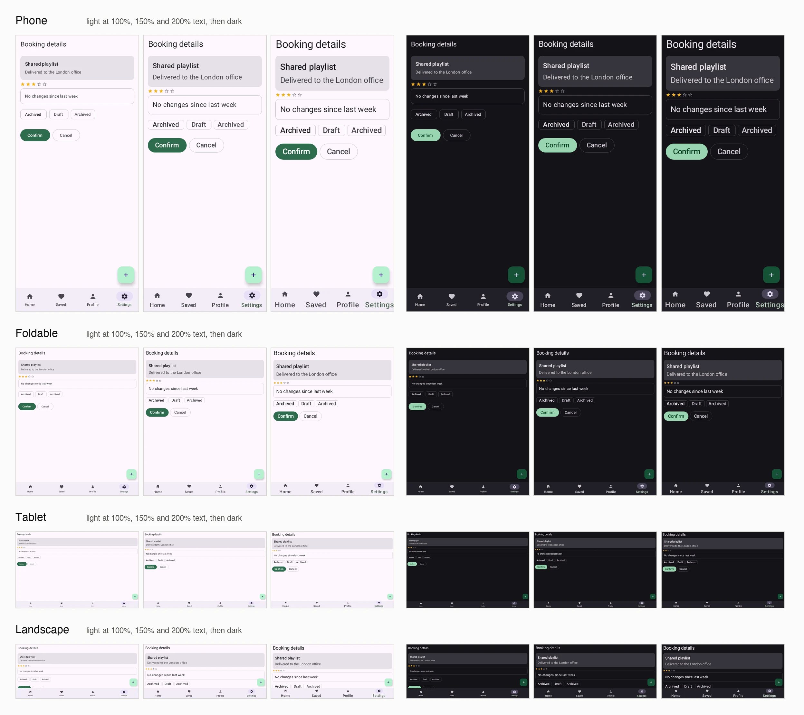
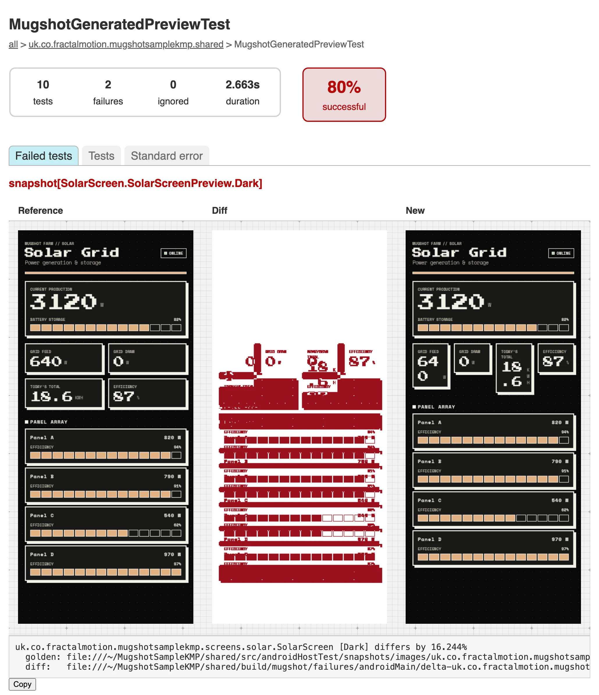
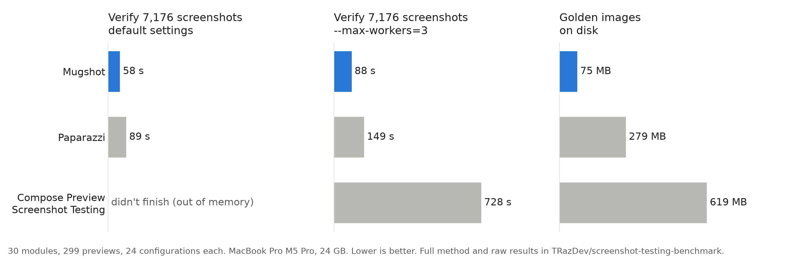

<div align="center">


# Mugshot

**Screenshot tests for your Compose previews. One annotation, no test code, no emulator.**

[](https://central.sonatype.com/artifact/uk.co.fractalmotion.mugshot/mugshot)


[](#license)

</div>

You already wrote a `@Preview` for most of your screens. Mugshot turns each one into a screenshot
test: put `@Mugshot` on it, record once, and the build fails whenever that screen changes. The
screens render on the JVM with layoutlib, the renderer behind Android Studio's previews, so the
tests run as ordinary unit tests on any machine that can build your app.



<sub>Golden images recorded from the previews in this repository's [`sample`](sample) module.
The last one is the profile screen with `@MugshotLocales` set to Arabic.</sub>

## Why Mugshot

There's no test class to write and no list of screens to keep in sync. A KSP processor finds every
annotated preview and generates the test, so adding a preview adds its screenshot and deleting one
removes it.

It works in Kotlin Multiplatform modules. Previews in `commonMain` are picked up like any others,
and Compose Multiplatform resources, including `stringResource`, render in the golden images.

It's quick. On a 30-module app with 7,176 screenshots, Mugshot verified everything in 58 seconds.
Paparazzi took 89, and Google's Compose Preview Screenshot Testing ran out of memory at default
settings. The [benchmark](#performance) has the details and a public repository to rerun it.

It stays out of your way in Gradle. Screenshot tests run in a task and a JVM of their own, so they
don't collide with Robolectric, and the plugin supports the configuration cache.

## Getting started

Apply KSP and the plugin to a module that has Compose previews:

```kotlin
plugins {
  id("com.google.devtools.ksp")
  id("uk.co.fractalmotion.mugshot") version "3.4.2"
}
```

Annotate a preview:

```kotlin
@Mugshot
@Preview
@Composable
internal fun ProfileScreenPreview() {
  AppTheme { ProfileScreen(state = sampleProfile) }
}
```

Record the golden images:

```bash
./gradlew recordMugshotDebug
```

The images are in `src/test/snapshots/images/`. Commit them, and from then on
`./gradlew verifyMugshotDebug` fails if any screen changes.



## Kotlin Multiplatform

Mugshot runs in a module that uses `com.android.kotlin.multiplatform.library`. Apply the same two
plugins and turn on host tests, which is where the generated test lives:

```kotlin
kotlin {
  android {
    withHostTest {
      isIncludeAndroidResources = true
    }
  }
}
```

That's the whole setup. The plugin adds the annotations to `commonMain` and the test machinery to
`androidHostTest`, so there are no dependencies to declare. Annotate previews in `commonMain`,
run `./gradlew :shared:recordMugshot`, and the golden images land in
`src/androidHostTest/snapshots/images/`.



<sub>[MugshotSampleKMP](https://github.com/TRazDev/MugshotSampleKMP) is a Compose Multiplatform app
for Android, iOS and desktop with Mugshot set up, and 192 golden images across four devices, two
themes and four locales.</sub>

The images are Android renders of your shared UI. Platform-specific code runs its Android
`actual`, so something that only differs on iOS won't show up.

## Annotations

`@Mugshot` records one image on the default device, a Pixel 10. Every other annotation adds an
axis, and axes multiply:

| Annotation | Renders |
| --- | --- |
| `@Mugshot` | one image at the defaults, required on every snapshotted preview |
| `@MugshotShrink` | wrapped to the content, for components and dialogs |
| `@MugshotFullScreen` | the whole scrollable height in one image |
| `@MugshotDevices` | `PHONE`, `FOLDABLE`, `TABLET`, `LANDSCAPE`, or the ones you name |
| `@MugshotWear` | a round and a square watch |
| `@MugshotLightDark` | light and dark |
| `@MugshotFontScales` | `1f`, `1.5f`, `2f`, or the ones you name |
| `@MugshotLocales("ar")` | the default locale plus each you name, mirroring right-to-left ones |
| `@MugshotMatrix` | devices × light/dark × font scales, 24 images |

`MugshotDevice` is one of `PHONE`, `FOLDABLE`, `TABLET`, `LANDSCAPE`, `WEAR_ROUND` and
`WEAR_SQUARE`.

`@MugshotMatrix` on a single preview gives you this:



### Narrowing an axis

Pass arguments to narrow an axis rather than dropping the annotation:

```kotlin
@Mugshot
@MugshotDevices(MugshotDevice.PHONE, MugshotDevice.TABLET)
@MugshotLightDark
@Preview
@Composable
internal fun ProfileScreenPreview() { ... }
// 2 devices × 2 appearances = 4 images
```

`@MugshotLocales` is the one axis that keeps a baseline of its own. The others already include
theirs (`PHONE`, light, `1f`), so naming a single locale gives you two images: the default and that
locale.

### Bundling

The annotations work on annotation classes as well as functions, so a team can put its house style
behind one name:

```kotlin
@Mugshot
@MugshotDevices(MugshotDevice.PHONE, MugshotDevice.TABLET)
@MugshotLightDark
annotation class OurScreenshots

@OurScreenshots
@Preview
@Composable
internal fun ProfileScreenPreview() { ... }
```

### Preview parameters

A `@PreviewParameter` provider is expanded when the test runs, one image per value, so a single
preview covers a screen's loading, empty and populated states:

```kotlin
@Mugshot
@Preview
@Composable
internal fun StorefrontScreenPreview(
  @PreviewParameter(StorefrontStateProvider::class) state: StorefrontUiState
) {
  MyTheme { StorefrontScreen(state) }
}
```

Images are indexed (`_0`, `_1`, …) rather than named after the value, because a value's
`toString()` isn't safe in a filename.

### Rules

An annotated function must be `@Composable`, must carry a `@Preview`, must not be `private`, and
must take no parameters other than a single `@PreviewParameter`.

A preview that breaks one of those rules is skipped. There's no test file to fail, so the build
stays green and no image appears. The lint checks turn that silence into a message:

```groovy
dependencies {
  lintChecks 'uk.co.fractalmotion.mugshot:mugshot-preview-lints:3.4.2'
}
```

| Check | Severity | Reports |
| --- | --- | --- |
| `ComposableAnnotationNotFound` | error | `@Mugshot` on a function that is not `@Composable` |
| `PreviewAnnotationNotFound` | error | `@Mugshot` with no `@Preview`, including one reached through a multi-preview annotation |
| `PrivatePreviewDetected` | error | `@Mugshot` on a private composable, which the generated test cannot call |
| `MugshotPreviewArgumentsIgnored` | warning | `@Preview` setting configuration Mugshot does not read |

The warning is worth having even when everything works. **`@Preview`'s own arguments are
ignored**: Mugshot takes its configuration from its annotations, so setting `device`, `uiMode`,
`locale` or `fontScale` on `@Preview` changes what the IDE renders while the golden image stays the
same.

[LIMITATIONS.md](LIMITATIONS.md) covers what Mugshot doesn't do and where its rendering differs from
a device.

## When a screen changes

A failed verification shows up in the HTML test report with the golden image, a difference image
and the new render side by side. In the difference image, red marks every pixel that changed and
everything else is white, so you can see at a glance which part of the screen moved.



The report is in `build/reports/tests/<testTask>`. The same images, plus a single combined image
the console error links to, go to `build/mugshot/failures` for CI to upload.

To make CI fail on visual changes:

```kotlin
tasks.named("check") {
  dependsOn("verifyMugshot")
}
```

If the change was intentional, record again and commit the new golden images with the code.

## Performance

Mugshot, Paparazzi and Google's Compose Preview Screenshot Testing screenshotted the same
generated app: 30 modules and 299 previews, each rendered on four devices, in light and dark, at
three font scales. That's 7,176 screenshots per tool.



| | Record | Verify | Verify, `--max-workers=3` | Golden images |
| --- | --- | --- | --- | --- |
| **Mugshot 3.4.2** | **62 s** | **58 s** | **88 s** | **75 MB** |
| Paparazzi 2.0.0-alpha05 | 107 s | 89 s | 149 s | 279 MB |
| Compose Preview Screenshot Testing 0.0.1-alpha16 | 226 s | out of memory | 728 s | 619 MB |

Verify times are the median of three runs on a MacBook Pro with an M5 Pro and 24 GB. Compose
Preview Screenshot Testing needed `android.compose.screenshot.maxHeapSize=2g` to record without
running out of memory, and even then couldn't verify at default parallelism on that machine.

Part of the lead comes from resolution. Mugshot renders the device at a third of its resolution,
Paparazzi renders at full size and shrinks the image to 1,000 pixels, and Compose Preview
Screenshot Testing keeps full size. At full resolution Mugshot verifies in 149 seconds, slower
than Paparazzi. The layout is identical either way, because Mugshot scales density along with the
screen, so every dp stays a dp.

Everything is reproducible from
[TRazDev/screenshot-testing-benchmark](https://github.com/TRazDev/screenshot-testing-benchmark):
the app, one branch per tool, the benchmark script and every raw result. It doesn't include
Roborazzi yet.

## Tasks

Each task has an anchor form that covers every variant and a per-variant form
(`recordMugshotDebug`, `verifyMugshotRelease`, and so on).

| Task | Does |
| --- | --- |
| `recordMugshot` | writes golden images to `src/test/snapshots` |
| `verifyMugshot` | renders and compares against the golden images |
| `cleanRecordMugshot` | deletes the golden images, then records |
| `deleteMugshotSnapshots` | deletes the golden images |

```bash
./gradlew recordMugshotDebug
./gradlew verifyMugshotDebug
./gradlew verifyMugshotDebug --tests '*ProfileScreen*'
```

### Where the images go

The generated test is `MugshotGeneratedPreviewTest`, in your module's namespace, so golden images
are named:

```
<namespace>_MugshotGeneratedPreviewTest_snapshot[<preview>_<axes>].webp
```

for example
`com.example.myapp_MugshotGeneratedPreviewTest_snapshot[ui_ProfileScreen_ProfileScreenPreview_Dark].webp`.

## Configuration

Set these in `gradle.properties`; the plugin forwards them to the test JVM.

| Property | Default | Does |
| --- | --- | --- |
| `uk.co.fractalmotion.mugshot.downscale` | `3` | render at 1/N of the device's resolution; `1` renders at full size |
| `uk.co.fractalmotion.mugshot.differ` | `offbytwo` | image comparison: `offbytwo`, `pixelperfect` |
| `uk.co.fractalmotion.mugshot.maxPercentDifferenceDefault` | `0.01` | how much difference a verification tolerates |
| `uk.co.fractalmotion.mugshot.defaultLocale` | unset | locale for every snapshot, e.g. `fr-rFR` |
| `uk.co.fractalmotion.mugshot.overwriteOnMaxPercentDifference` | `false` | rewrite golden images that differ within the threshold |
| `uk.co.fractalmotion.mugshot.isolateTests` | `true` | run generated tests in their own task and JVM |

### Resolution

Snapshots render a third of the device's resolution by default. Dimensions, dpi and density scale
together, so every dp stays a dp and the layout is identical to the full-size device, with fewer
pixels in it. On a 30-module project of 7,176 images that made verification 27% faster and the
golden images 45% smaller. Nothing is resampled after rendering, so glyph edges come out crisper,
though at that size letter spacing can be slightly uneven.

`uk.co.fractalmotion.mugshot.downscale=1` renders at the device's own resolution. That's the most
detail available, so lower values are rejected. Two reasons to reach for it:

- A module shipping density-qualified bitmaps. The qualifier resolves from the scaled density, so
  a `drawable-xxhdpi` PNG can be passed over for one the real device wouldn't pick. Vector and
  Compose UIs are unaffected.
- Small text you need to read in a failure report, where a third of the pixels is a third of the
  glyph.

Changing it changes every image, so re-record when you do.

## Beyond annotations

Some things the annotations don't reach. For those, drive the rule yourself:

```kotlin
class ProfileScreenTest {
  @get:Rule
  val mugshot = Mugshot(
    deviceConfig = DeviceConfig.PIXEL_6,
    theme = "android:Theme.Material.Light.NoActionBar",
    showSystemUi = true
  )

  @Test
  fun profile() {
    mugshot.snapshot { MyTheme { ProfileScreen(state = sampleProfile) } }
  }
}
```

Reachable only this way: `unsafeUpdateConfig` to change device, theme or rendering mode part-way
through a test; a custom `RenderExtension` to decorate every snapshot; `showSystemUi`, `downscale`
and `maxPercentDifference`; and Android Views, via `mugshot.inflate<MyView>(R.layout.my_view)` and
`mugshot.snapshot(view)`. For JUnit 5, build the rule yourself and call `setup(TestName(...))` and
`teardown()` around each test.

The [sample][sample] project's `screen/` and `component/` test packages have worked examples of
each.

## What Mugshot needs from a module

**Mugshot and Robolectric can't share a JVM.** Mugshot loads layoutlib's native library, patches
`Build.VERSION`, and permanently redefines `android.view.View.isInEditMode` in the test JVM through
a Byte Buddy agent. Robolectric's own native setup then fails with `UnsatisfiedLinkError`,
including in Robolectric tests that take no screenshots at all.

Generated preview tests keep out of the way. The plugin runs them in a task of their own,
`mugshotTest<Variant>`, with its own JVM, and leaves them out of the module's unit test task, so
Robolectric tests in the same module keep working. `uk.co.fractalmotion.mugshot.isolateTests=false`
puts them back in the unit test task.

Hand-written Mugshot tests can't be separated that way, because nothing about them is visible to
the plugin. They run with the rest of the module's unit tests, so a module whose Robolectric tests
have to stay needs its hand-written Mugshot tests in a module of their own.

**Tests must not run concurrently inside one JVM.** Layoutlib is initialised once and reused, which
is most of why a suite is quick, and the renderer that holds it is shared by every test in the
JVM. Gradle's default of a worker per fork is fine, and so is `maxParallelForks`, which forks more
JVMs. Running tests concurrently within one JVM, with JUnit 5's parallel execution for instance,
isn't: they will render over each other.

## Golden image names

A golden image is named after the test that took it: the package, the class, the method, and the
label if `snapshot` was given one. Nothing about those is bounded, and a name has to survive a
filesystem, so a name longer than 200 characters keeps its readable beginning and ends in a hash of
the whole of it:

```
com.example.feature_VeryLongTest_aVeryLongMethodName...~3f9c1a7b2e04.webp
```

The hash comes from the full name, so it's the same on every machine and every run, and two long
names that begin alike stay apart. Real names are nowhere near the limit (the longest in this
repository's own sample is 136 characters), so this only affects names that would otherwise be
rejected.

Windows caps a whole path at 260 characters unless long paths are turned on. A deep module tree can
reach that even with a name under the limit, so on Windows it's worth enabling long path support in
both the OS and Git:

```bash
git config --global core.longpaths true
```

## Git LFS

We recommend storing golden images with [Git LFS][lfs]:

```bash
brew install git-lfs
git config core.hooksPath  # optional, confirm where your git hooks will be installed
git lfs install --local
git lfs track "**/snapshots/**/*.webp"
git add .gitattributes
# Optional to improve git checkout performance
git config lfs.setlockablereadonly false
```

On CI, you might set up something like:

`$HOOKS_DIR/pre-receive`
```bash
# compares files that match .gitattributes filter to those actually tracked by git-lfs
diff <(git ls-files ':(attr:filter=lfs)' | sort) <(git lfs ls-files -n | sort) >/dev/null

ret=$?
if [[ $ret -ne 0 ]]; then
  echo >&2 "This remote has detected files committed without using Git LFS. Run 'brew install git-lfs && git lfs install' to install it and re-commit your files.";
  exit 1;
fi
```

`your_build_script.sh`
```bash
if [[ is running snapshot tests ]]; then
  # fail fast if files not checked in using git lfs
  "$HOOKS_DIR"/pre-receive
  git lfs install --local
  git lfs pull
fi
```

## More

- [MugshotSampleKMP](https://github.com/TRazDev/MugshotSampleKMP): a Compose Multiplatform app
  for Android, iOS and desktop with Mugshot set up
- [screenshot-testing-benchmark](https://github.com/TRazDev/screenshot-testing-benchmark): the same
  app tested with Mugshot, Paparazzi and Compose Preview Screenshot Testing, with the benchmark and
  results
- Articles:
  - Screenshot tests for your Compose previews, with one annotation
  - My screenshot tests spent more time shrinking images than rendering them
  - Screenshot testing a Compose Multiplatform app without an emulator
  - Mugshot, Paparazzi and Compose Preview Screenshot Testing on the same 7,176 screenshots

## Releases

The [change log][changelog] has release history.

Using the plugins DSL:
```groovy
plugins {
  id 'uk.co.fractalmotion.mugshot' version '3.4.2'
}
```

Using plugin application:
```groovy
buildscript {
  repositories {
    mavenCentral()
    google()
  }
  dependencies {
    classpath 'uk.co.fractalmotion.mugshot:mugshot-gradle-plugin:3.4.2'
  }
}

apply plugin: 'uk.co.fractalmotion.mugshot'
```

Snapshots of the development version are available in [the Central Portal Snapshots repository][snap]:

```groovy
repositories {
  // ...
  maven {
    url 'https://central.sonatype.com/repository/maven-snapshots/'
  }
}
```

## Credits

Mugshot is a fork of [Paparazzi][upstream], created and maintained by Square, Inc. Essentially all
of the hard engineering here, the layoutlib integration, the resource loading and the rendering
pipeline, is their work. This fork exists to take the project in a direction that would have been
too breaking to land upstream, and is not affiliated with, endorsed by, or sponsored by Square,
Inc. or Cash App.

See [NOTICE](NOTICE) for the full attribution and a summary of what has changed.

## License

```
Copyright 2019 Square, Inc.
Copyright 2026 Fractal Motion

Licensed under the Apache License, Version 2.0 (the "License");
you may not use this file except in compliance with the License.
You may obtain a copy of the License at

   http://www.apache.org/licenses/LICENSE-2.0

Unless required by applicable law or agreed to in writing, software
distributed under the License is distributed on an "AS IS" BASIS,
WITHOUT WARRANTIES OR CONDITIONS OF ANY KIND, either express or implied.
See the License for the specific language governing permissions and
limitations under the License.
```

 [sample]: https://github.com/TRazDev/Mugshot/tree/main/sample
 [lfs]: https://git-lfs.github.com/
 [upstream]: https://github.com/cashapp/paparazzi
 [changelog]: https://github.com/TRazDev/Mugshot/blob/main/CHANGELOG.md
 [snap]: https://central.sonatype.com/service/rest/repository/browse/maven-snapshots/uk/co/fractalmotion/mugshot/
